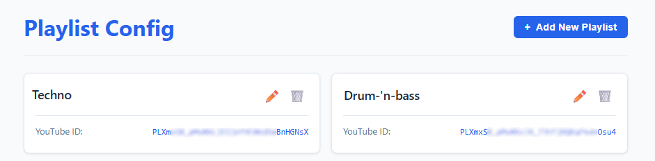
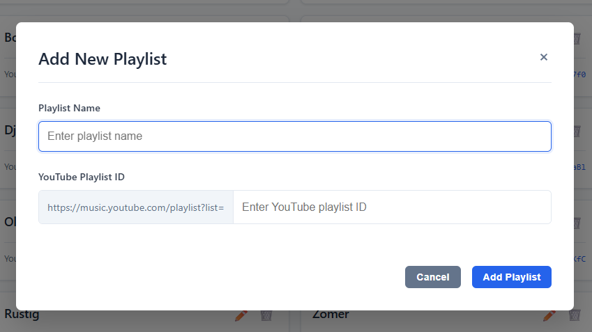

# Music Downloader

## Overview

A web-based service for downloading music and media files. Built with Node.js and Express, it provides a secure web interface to manage and queue downloads, powered by `yt-dlp` (via `youtube-dl-exec`). It includes built-in session-based authentication and SQLite for persistent storage, making it fully self-contained and easily deployable via Docker.

## Features

- **Web Interface:** Easy-to-use frontend powered by Pug templates to queue and manage your downloads.
- **Robust Downloader:** Utilizes `youtube-dl-exec` (yt-dlp) for reliable media extraction.
- **Secure Access:** Built-in session management and authentication to keep your instance private.
- **Background Processing:** Dedicated download service that handles queues asynchronously.
- **Containerized:** Docker support out-of-the-box for quick and reproducible deployments.

## Screenshots

| Playlist config                                                            | Add playlist                                                            |
| -------------------------------------------------------------------------- | ----------------------------------------------------------------------- |
|  |  |

## Architecture

The application is structured to decouple the web interface from the download processing:

- **Backend:** Node.js with Express, handling API routes and session authentication.
- **Frontend:** Server-side rendered pages using Pug and plain web technologies.
- **Database:** SQLite (with Sequelize) is used for managing download history and secure sessions.
- **Services:** A standalone download service (`services/downloadService.js`) processes the download queue independently of web requests.
- **Media Optimization:** Integrates `sharp` for potential image and thumbnail processing.

## Quick Start

1. Clone the repository:

```bash
git clone https://github.com/RenautMestdagh/music-downloader.git
cd music-downloader
```

2. Install dependencies:

```bash
npm install
```

3. Configure the environment:
   Copy the example configuration to a new `.env` file and customize your settings.

```bash
cp .env.example .env
```

_(Make sure to update `BASIC_AUTH_USER` and `BASIC_AUTH_PASSWORD` in your `.env` file)._

4. Start the server:

```bash
npm start
```

_For development, you can use `npm run devstart` (with nodemon, if configured)._

5. Open your browser and navigate to `http://localhost` (or your configured port).

## Docker Deployment

To run the server using Docker:

```bash
npm run build
docker run -d -p 80:80 musicdownloader:latest
```

## Usage

- Log into the web interface using the credentials defined in your `.env` file.
- Submit links to begin processing and downloading media.
- The built-in dashboard will allow you to track the progress of ongoing downloads via the background service.

## Disclaimer

This project is intended for personal and educational use. Please ensure you have the appropriate rights and permissions before downloading content from external platforms.

## About

Node.js web service featuring a secure Pug-based UI and a robust yt-dlp backend for personal music and media downloads.
